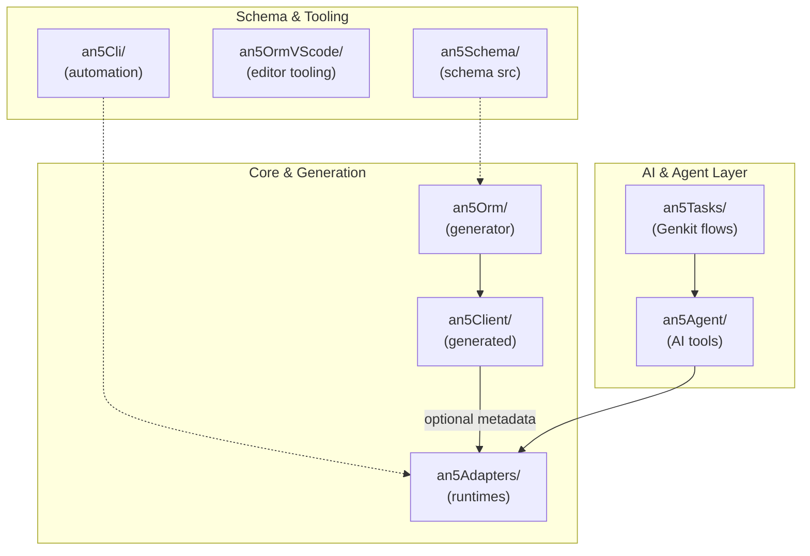
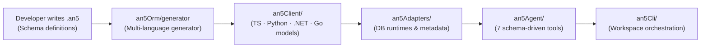
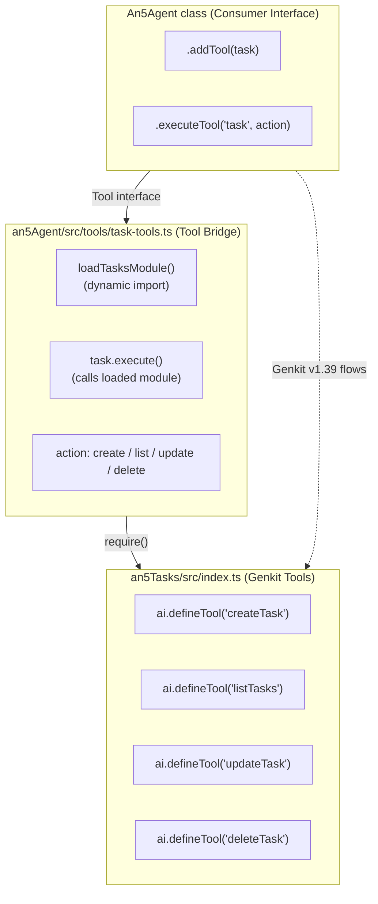

# AN5 Architecture

## Overview

Multi-repository monorepo providing a SQL Server schema-driven development platform with multi-language code generation, provider-based runtime adapters, and AI-powered agent assistance.

## Repository Roles

| Repo | Role | Key Capabilities |
|------|------|------------------|
| **an5Orm** | Schema, Generator & Migrations | Schema parser, multi-language code generator, database introspection (`pull.ts`), schema push (`push.ts`), migrations (`migrate.ts`), and seeder runner |
| **an5Client** | Generated artifacts | TypeScript model interfaces + metadata, Python dataclasses + metadata, .NET entity classes, Go structs/client |

## Data Flow

## Cross-Repo Connections

| Source | Target | Mechanism |
|--------|--------|-----------|
| `an5Agent` | `an5Adapters` | Dynamic `require()` via relative path |
| `an5Agent` | `an5Tasks` | Dynamic `require()` — bridges Genkit tools into agent Tool interface |
| `an5Agent` | `an5Client` | Metadata file read for model info |
| `an5Agent` | `an5Schema` | Directory scan for `.an5` files |
| generated clients | `an5Adapters` | Optional metadata injection for model/table mapping |
| `an5Orm` | own `an5Metadata.ts` | Local metadata require — the core never imports the generated client (the client is generated *from* the ORM) |
| `an5Orm` | `an5Adapters` | `An5Adapter` (via `createAn5Adapter`) for DB operations |
| `an5Orm/generator` | `an5Client/*` | **Writes** generated files |
| `an5Orm/generator` | `an5Schema/` | **Reads** .an5 definitions |
| `an5Cli` | `an5Tasks` | Dynamic `require()` for task operations |

## Agent Tools (7 consolidated)

### Schema (1 tool with 3 actions)
| Tool | Actions | Description |
|------|---------|-------------|
| `schema` | list, describe, relations | Explore data models |

### Query (1 tool with 3 actions)
| Tool | Actions | Description |
|------|---------|-------------|
| `query` | generate, explain, validate | Work with SQL queries |

### Database (1 tool with 3 actions)
| Tool | Actions | Description |
|------|---------|-------------|
| `database` | execute, describe, health | Database operations |

### Code Generation (2 tools)
| Tool | Description |
|------|-------------|
| `generateClientCode` | Generate TS/Python/.NET/Go client code |
| `analyzeSchema` | Analyze schema for design issues |

### RAG (1 tool with 2 actions)
| Tool | Actions | Description |
|------|---------|-------------|
| `retrieve` | schema, queries | Semantic search |

### Task Management (1 tool with 4 actions)
| Tool | Actions | Description |
|------|---------|-------------|
| `task` | create, list, update, delete | Manage tasks |

## LLM Integration

| Provider | Env Variable | Default Model |
|----------|-------------|---------------|
| OpenAI | `OPENAI_API_KEY` / `LLM_API_KEY` | `gpt-4o-mini` |
| Gemini | `GEMINI_API_KEY` / `LLM_API_KEY` | `gemini-2.5-flash` |
| Custom | `LLM_ENDPOINT` | `llama3` |

## Genkit Integration

| Module | Role | Features |
|--------|------|----------|
| `an5Tasks` | Tool provider | `ai.defineTool()`, `ai.defineFlow()`, `ai.generate()` |
| `an5Agent` | Tool consumer | Bridges Genkit tools into agent `Tool` interface via `task-tools.ts` |

### Genkit Tools (defined in an5Tasks, used by an5Agent)

| Tool | Input | Output |
|------|-------|--------|
| `createTask` | type, description, file? | Task object |
| `listTasks` | workspaceDir, status?, priority? | Task[] |
| `updateTask` | workspaceDir, taskId, status?, priority? | Task \| null |
| `deleteTask` | workspaceDir, taskId | boolean |

### Genkit Flows

| Flow | Description |
|------|-------------|
| `parseReviewToTasksFlow` | Regex-based task extraction from LLM reviews |
| `aiParseReviewToTasksFlow` | AI-powered task extraction using `generate()` |

### Architecture: Genkit Bridge

The bridge works by:
1. `an5Tasks` defines Genkit tools with `ai.defineTool()`
2. `an5Agent/src/tools/task-tools.ts` consolidates 4 tools into 1 `task` tool
3. `an5Agent` registers all 7 tools in `DEFAULT_TOOLS`
4. `process()` matches natural language → routes to appropriate tool/action
