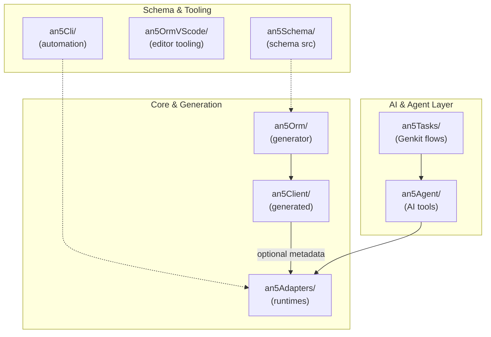
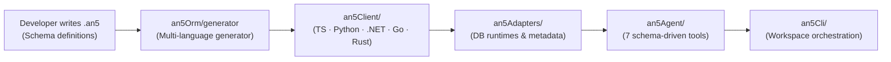
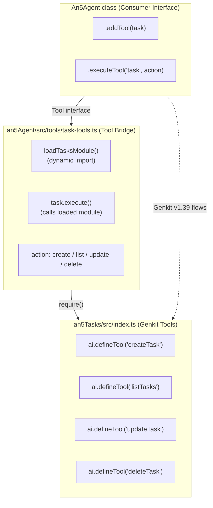

# Architecture

Multi-repository monorepo providing a SQL Server schema-driven development platform with multi-language code generation, provider-based runtime adapters, and AI-powered agent assistance.

## System Overview

> The ORM owns its metadata locally (generated `an5Metadata.ts`) and never imports from
> the generated client. The client is generated *from* the ORM, and adapters receive
> metadata only when it is passed explicitly.

## Repository Roles

| Repository | Role | Key Capabilities |
|------------|------|------------------|
| **an5Adapters** | Runtime Execution Engine & Query Builder | Provider-based SQL (MSSQL, Postgres, MySQL, SQLite), Google Sheets, and NBase vector engine execution, Query Builder (`parseWhere`, `buildOrderBy`, `quote`), `executorFromAdapter` bridge, connection pooling, and multi-language sources (TS, Python, .NET, Go, Rust). |
| **an5Orm** | Schema, Generator & Migrations | Schema parser, multi-language code generator (`generator/`), database introspection (`pull.ts`), schema drift & migrations (`migrate.ts`, `migration-core.ts`), schema push (`push.ts`), and generic seeder runner (`seed.ts`). |
| **an5Client** | Generated Artifacts | TypeScript model interfaces + metadata, Python dataclasses + metadata, .NET entity classes, Go structs/client, and Rust models/client crate. |
| **an5Agent** | AI Agent Library | 7 schema-driven tools: schema, query, database, codegen, retrieve, task, analyzeSchema |
| **an5Cli** | Workspace Automation & Release | Workspace release (`ws`), changelog generation, LLM-powered commits, local management UI |
| **an5OrmVScode** | Editor Extension & MCP Server | Syntax highlighting, formatter, snippets for `.an5` files, and native Model Context Protocol (MCP) server. |
| **an5Schema** | Schema Source | Sample `.an5` model definitions |
| **an5Tasks** | Task Manager | Genkit v1.42+ flows, LLM review parsing, task CRUD, tools for agent integration |
| **an5example** | Reference Examples | Multi-dialect CRUD suite, browser (sql.js) support, runnable TypeScript/Go/.NET/Python/Rust client examples |
| **an5Site** | Landing Page | Static site source (`index.html` + `style.css` + `main.js`) for https://an5orm.github.io, registered as `an5-site` npm workspace |
| **an5Docs** | Documentation Site | Jekyll documentation site serving 670+ pages with responsive UI, context switching, and SEO audit tooling |

## Data Flow

## Cross-Repo Connections

| Source | Target | Mechanism |
|--------|--------|-----------|
| `an5Agent` | `an5Adapters` | Dynamic `require()` via relative path |
| `an5Agent` | `an5Tasks` | Dynamic `require()` — bridges Genkit tools into agent Tool interface |
| `an5Agent` | `an5Client` | Metadata file read for model info |
| `an5Agent` | `an5Schema` | Directory scan for `.an5` files |
| generated clients | `an5Adapters` | Optional metadata injection for model/table mapping |
| `an5Orm` | own `an5Metadata.ts` | Local metadata require — the core never imports the generated client (the client is generated *from* the ORM) |
| `an5Orm` | `an5Adapters` | `An5Adapter` (constructed directly from the `DATABASE_URL`-derived config) for DB operations |
| `an5Orm/generator` | `an5Client/*` | **Writes** generated files |
| `an5Orm/generator` | `an5Schema/` | **Reads** .an5 definitions |
| `an5Cli` | `an5Tasks` | Dynamic `require()` for task operations |

## Agent Tools Architecture (7 Consolidated)

### Schema (1 tool with 3 actions)

| Tool | Actions | Description |
|------|---------|-------------|
| `schema` | list, describe, relations | Explore data models |

### Query (1 tool with 3 actions)

| Tool | Actions | Description |
|------|---------|-------------|
| `query` | generate, explain, validate | Work with SQL queries |

### Database (1 tool with 3 actions)

| Tool | Actions | Description |
|------|---------|-------------|
| `database` | execute, describe, health | Database operations |

### Code Generation (2 tools)

| Tool | Description |
|------|-------------|
| `generateClientCode` | Generate TS/Python/.NET/Go/Rust client code |
| `generateCode` | Schema-grounded application code or context for the calling model |
| `analyzeSchema` | Analyze schema for design issues |

### RAG (1 tool with 2 actions)

| Tool | Actions | Description |
|------|---------|-------------|
| `retrieve` | schema, queries | Semantic search |

### Task Management (1 tool with 4 actions)

| Tool | Actions | Description |
|------|---------|-------------|
| `task` | create, list, update, delete | Manage tasks |

## LLM Integration

| Provider | Env Variable | Default Model |
|----------|-------------|---------------|
| OpenAI | `OPENAI_API_KEY` / `LLM_API_KEY` | `gpt-4o-mini` |
| Gemini | `GEMINI_API_KEY` / `LLM_API_KEY` | `gemini-2.5-flash` |
| Custom | `LLM_ENDPOINT` | `llama3` |

At runtime the active LLM/embedding config can be read and updated through the
`@an5/adapters` config API (`getLlmConfig`/`setLlmConfig`,
`getEmbeddingConfig`/`setEmbeddingConfig`).

## Technology Stack

- **Runtime**: Node.js 18+
- **Language**: TypeScript
- **Database**: SQL Server (primary), PostgreSQL, MySQL, SQLite
- **AI Framework**: Google Genkit v1.39
- **Build Tool**: npm workspaces
- **Testing**: Node built-in test runner (`node test/*.test.js`)
- **Documentation**: Jekyll (GitHub Pages)

## Related

- [Getting Started]({{ '/guides/getting-started/' | relative_url }}) - Quick start guide
- [Package Documentation](https://github.com/an5ORM/an5#readme) - Explore individual packages
