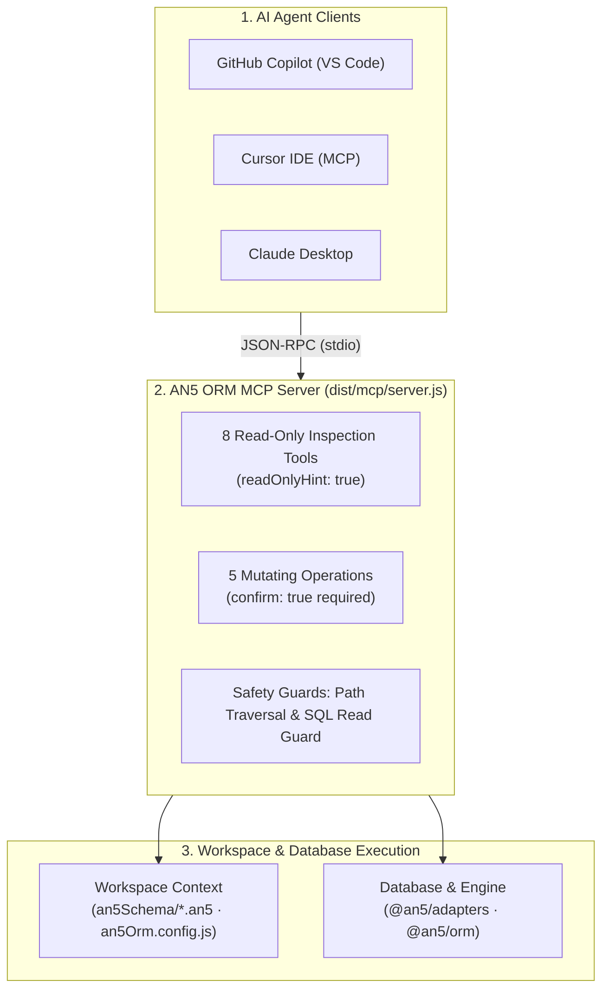

# VS Code MCP Server

The [AN5 ORM Schema Tooling extension](https://marketplace.visualstudio.com/items?itemName=an5orm.an5-orm-vscode) (`an5-orm-vscode`) ships a native [Model Context Protocol (MCP)](https://modelcontextprotocol.io) server over standard I/O (stdio).

This server bridges your database models, SQL execution engine, and schema workflows directly to AI agent assistants—including **GitHub Copilot in VS Code**, **Cursor**, **Claude Desktop**, and any standard MCP client.

---

## Architecture & Integration Flow



---

## 1. Quick Setup & Discovery

<div class="arch-grid-2">
  <div class="arch-module-card">
    <div class="arch-module-header">
      <div class="arch-module-title">
        <i class="fas fa-magic"></i> Automatic Discovery
      </div>
      <span class="arch-module-badge">VS Code 1.101+</span>
    </div>
    <p style="font-size: 0.9rem; color: #cbd5e1; margin-bottom: 12px;">
      The extension registers an automatic <code>mcpServerDefinitionProviders</code> handler. No configuration file needed.
    </p>
    <ul class="arch-item-list">
      <li class="arch-item">
        <code>Ctrl+Shift+P</code>
        <span class="arch-item-desc">Open Command Palette</span>
      </li>
      <li class="arch-item">
        <code>MCP: List Servers</code>
        <span class="arch-item-desc">Browse available servers</span>
      </li>
      <li class="arch-item">
        <code>Start AN5 ORM</code>
        <span class="arch-item-desc">Click to run immediately</span>
      </li>
    </ul>
  </div>

  <div class="arch-module-card">
    <div class="arch-module-header">
      <div class="arch-module-title">
        <i class="fas fa-terminal"></i> Workspace Install
      </div>
      <span class="arch-module-badge">Cursor / Portable</span>
    </div>
    <p style="font-size: 0.9rem; color: #cbd5e1; margin-bottom: 12px;">
      Writes resolved execution paths into <code>.mcp.json</code> or <code>.vscode/mcp.json</code> preserving other servers.
    </p>
    <ul class="arch-item-list">
      <li class="arch-item">
        <code>AN5: Install MCP Server</code>
        <span class="arch-item-desc">Generate workspace config</span>
      </li>
      <li class="arch-item">
        <code>AN5: Show MCP Server Config</code>
        <span class="arch-item-desc">Inspect JSON definition</span>
      </li>
      <li class="arch-item">
        <code>Status Bar &gt; AN5 ORM</code>
        <span class="arch-item-desc">One-click quick actions</span>
      </li>
    </ul>
  </div>
</div>

### Sample Generated Workspace Configuration

When running **AN5: Install MCP Server** or inspecting via **AN5: Show MCP Server Configuration**, the server outputs the exact path to the active extension bundle:

```json
{
  "mcpServers": {
    "an5-orm": {
      "type": "stdio",
      "command": "/usr/bin/node",
      "args": [
        "~/.vscode/extensions/an5orm.an5-orm-vscode-1.2.0/dist/mcp/server.js"
      ],
      "cwd": "${workspaceFolder}"
    }
  }
}
```

> **Runtime Execution Note**: The server uses Node.js to launch the script. System Node and version manager binaries (`nvm`, `fnm`, `volta`, `asdf`) are fully supported. When running inside VS Code, the extension automatically discovers the host runtime path.

---

## 2. Workspace Context Discovery

When started, the MCP server analyzes your repository environment without requiring manual CLI arguments:

1. **Configuration**: Evaluates `an5Orm.config.js` or `an5Orm.config.cjs` to locate `schemaDir` (defaults to `an5Schema/`).
2. **Schema Files**: Scans `.an5` files up to 4 directory levels deep, filtering out `node_modules`, `.git`, `dist`, and `target`. If `an5Schema/` is empty, it falls back to scanning the project root.
3. **Database URL**: Automatically reads `DATABASE_URL` from active process environment variables or parses the workspace `.env` file.
4. **Local Engine**: Detects the project's installed `@an5/orm` and `@an5/adapters` packages to ensure scripts run against the project's exact dependency versions.

---

## 3. Tool Reference (13 Tools)

Tools are organized into two distinct safety tiers:

<div class="arch-grid-2">
  <div class="arch-module-card">
    <div class="arch-module-header">
      <div class="arch-module-title">
        <i class="fas fa-eye"></i> Tier 1: Read-Only
      </div>
      <span class="arch-module-badge" style="background: rgba(56, 189, 248, 0.15); color: #38bdf8; border-color: rgba(56, 189, 248, 0.3);">Autonomous</span>
    </div>
    <div class="arch-subgroup">
      <div class="arch-subgroup-title">
        <i class="fas fa-shield-alt"></i> Safe &bull; readOnlyHint: true
      </div>
      <ul class="arch-item-list">
        <li class="arch-item"><code>an5_list_models</code> <span class="arch-item-desc">Overview of all models</span></li>
        <li class="arch-item"><code>an5_describe_model</code> <span class="arch-item-desc">Fields, types, relations</span></li>
        <li class="arch-item"><code>an5_get_relations</code> <span class="arch-item-desc">Relation graph (FK/LK)</span></li>
        <li class="arch-item"><code>an5_analyze_schema</code> <span class="arch-item-desc">Audit keys, indexes, audit</span></li>
        <li class="arch-item"><code>an5_read_schema_file</code> <span class="arch-item-desc">Read raw .an5 file</span></li>
        <li class="arch-item"><code>an5_describe_table</code> <span class="arch-item-desc">Columns &amp; constraints</span></li>
        <li class="arch-item"><code>an5_database_health</code> <span class="arch-item-desc">Latency &amp; connection check</span></li>
        <li class="arch-item"><code>an5_query_database</code> <span class="arch-item-desc">Read-only SELECT / CTE</span></li>
      </ul>
    </div>
  </div>

  <div class="arch-module-card">
    <div class="arch-module-header">
      <div class="arch-module-title">
        <i class="fas fa-pen-nib"></i> Tier 2: Mutating
      </div>
      <span class="arch-module-badge" style="background: rgba(249, 115, 22, 0.15); color: #fb923c; border-color: rgba(249, 115, 22, 0.3);">confirm: true</span>
    </div>
    <div class="arch-subgroup">
      <div class="arch-subgroup-title">
        <i class="fas fa-user-shield"></i> Requires User Approval
      </div>
      <ul class="arch-item-list">
        <li class="arch-item"><code>an5_generate_client</code> <span class="arch-item-desc">TS/Python/.NET/Go/Rust</span></li>
        <li class="arch-item"><code>an5_push_schema</code> <span class="arch-item-desc">Additive DDL push to DB</span></li>
        <li class="arch-item"><code>an5_pull_schema</code> <span class="arch-item-desc">Introspect DB into .an5</span></li>
        <li class="arch-item"><code>an5_migrate</code> <span class="arch-item-desc">diff, apply, rollback</span></li>
        <li class="arch-item"><code>an5_seed</code> <span class="arch-item-desc">Execute db:seed script</span></li>
      </ul>
    </div>
  </div>
</div>

### Detailed Tool Specifications

| Tool | Parameters | Description |
| :--- | :--- | :--- |
| `an5_list_models` | *(none)* | Returns the total count, physical table mapping, and field/relation summaries for every declared model. |
| `an5_describe_model` | `model: string` | Returns full field metadata (`sqlType`, `optional`, `primaryKey`, `unique`, `hasDefault`, `description`) and relation connections. |
| `an5_get_relations` | *(none)* | Returns an edge array representing foreign-key and local-key links between models (`one-to-many`, `many-to-one`). |
| `an5_analyze_schema` | *(none)* | Runs automated static analysis: flags missing primary keys, unindexed foreign keys, and missing audit timestamps (`createdAt`, `updatedAt`). |
| `an5_read_schema_file` | `file: string` | Returns full raw text of a `.an5` file. Validates that the target path is strictly within the workspace root to prevent path traversal. |
| `an5_describe_table` | `table: string` | Checks the schema model first; if absent, inspects physical database metadata directly. |
| `an5_database_health` | *(none)* | Performs a round-trip connection probe, reporting connection state and latency in milliseconds. |
| `an5_query_database` | `sql: string` | Executes read-only queries. Permits single-statement `SELECT` and read-only CTEs (`WITH ... SELECT`). Rejects multi-statements and mutation keywords (`INTO`, `INSERT`, `UPDATE`, `DELETE`, `DROP`, `ALTER`, `CREATE`, `TRUNCATE`, `EXEC`). |
| `an5_generate_client` | `language: string`, `outputDir?: string`, `confirm: boolean` | Triggers the code generator for `typescript`, `python`, `dotnet`, `golang`, `rust`, `java`, `kotlin` or `swift`. |
| `an5_push_schema` | `confirm: boolean` | Executes an additive schema sync (`db:push`) to create tables and add missing columns. |
| `an5_pull_schema` | `confirm: boolean` | Overwrites local `.an5` schemas with introspected database structure (`db:pull`). |
| `an5_migrate` | `action: string`, `steps?: number`, `preview?: boolean`, `confirm: boolean` | Manages schema migrations: `diff`, `generate`, `apply`, `rollback`, or `status`. |
| `an5_seed` | `confirm: boolean` | Populates the connected database using the project seed script (`db:seed`). |

---

## 4. Cursor & Claude Desktop Setup

### Claude Desktop

Open `claude_desktop_config.json`:
- **macOS**: `~/Library/Application Support/Claude/claude_desktop_config.json`
- **Windows**: `%APPDATA%\Claude\claude_desktop_config.json`
- **Linux**: `~/.config/Claude/claude_desktop_config.json`

Add the server definition:

```json
{
  "mcpServers": {
    "an5-orm": {
      "command": "node",
      "args": [
        "/absolute/path/to/an5orm.an5-orm-vscode/dist/mcp/server.js"
      ],
      "cwd": "/path/to/your/project",
      "env": {
        "DATABASE_URL": "sqlserver://localhost:1433;database=mydb;user=sa;password=secret"
      }
    }
  }
}
```

### Cursor IDE

1. Open **Settings** &rarr; **Features** &rarr; **MCP**.
2. Click **+ Add New MCP Server**.
3. Select **Type**: `command` (stdio).
4. Paste the command and argument values obtained from **AN5: Show MCP Server Configuration**.

---

## 5. Security & Isolation Guarantees

- **Path Traversal Protection**: File operations in `an5_read_schema_file` verify that canonical paths remain strictly within the workspace boundary. Relative escapes (`../`) and external symlinks are rejected.
- **SQL Guardrails**: `an5_query_database` blocks schema-altering statements, chained semicolons, and write queries.
- **Protocol Separation**: Standard output (`stdout`) is strictly reserved for JSON-RPC MCP messages. Diagnostic outputs and warnings are redirected to `stderr` (`[an5-orm-mcp]`) to prevent protocol corruption.
- **Mandatory Human Confirmation**: Destructive operations cannot be executed autonomously by an AI agent; the parameter `confirm: true` must be explicitly approved.

---

## 6. Extension UI & Agent Skills Sync

Beyond the MCP server, the `an5-orm-vscode` extension provides dedicated developer tools in the Activity Bar:

### Activity Bar Views

- **Connections (`an5.connections`)**: Securely manage database profiles. Test live connections, set active profile for tasks and debug terminals, or remove stale credentials.
- **Schema Explorer (`an5.schema`)**: Inspect parsed `.an5` models, primary keys, fields, and relations directly in the sidebar tree.
- **Project Actions (`an5.actions`)**: Fast one-click shortcuts for `an5 generate`, `an5 push`, `an5 pull`, and MCP installation.

### Agent Skills Synchronization

Running **AN5: Sync Agent Skills** (`an5.agentSkills.sync`) automatically provisions repository agent context:
1. Copies the managed ORM instructions template to `.agents/skills/an5-orm/SKILL.md`.
2. Inspects `an5Orm.config.js` and `package.json` npm scripts.
3. Updates the `<!-- AN5 agent context: start -->` block in `AGENTS.md` so coding assistants immediately recognize local project conventions without leaking credentials.

## Application code from a user request

Call `an5_generate_code` with `request` and optional `language`. It returns schema, configured client location and generated API references for the calling AI model to write the requested snippet. It does not invoke a separate LLM or write application files. Choose the language explicitly in multilingual workspaces. The installed ORM must export `prepareCodeRequest`; older builds report an upgrade error.

## Configure project paths and sign in to Google Sheets

The connection manager includes **Project configuration** for editing schema and client output paths without manually rewriting the ORM config. It preserves existing custom settings and writes a managed path block. Saving settings does not run generation or change the database.

Choose **Sheets**, then import a Google Desktop OAuth client JSON or enter the Client ID in **Google OAuth application setup**. Enable Sheets API and Drive API and configure consent/test users in your Google Cloud application. Click **Sign in with Google** and select a spreadsheet from the account. Tokens and OAuth client settings stay in VS Code SecretStorage, and the updated Sheets adapter refreshes access automatically.

The Google flow requests spreadsheet read/write access and Drive metadata to list files. It currently needs a local VS Code window: remote/Codespace extension hosts can continue using service accounts. A real OAuth client must be configured before testing with a Google account.
